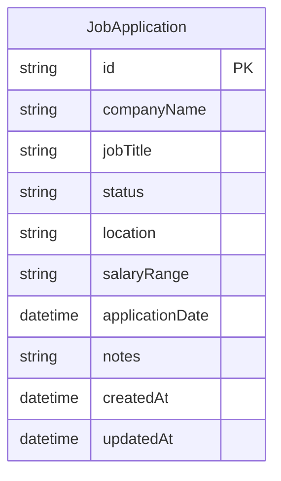

# Job Application Tracker

> ⚠️ **NOTE**: This project was developed entirely using Artificial Intelligence (AI). The purpose of this work is to test the limits of AI capabilities, explore its design choices, and compare AI-generated solutions with my own projects. The code integrity, quality, and coding style may differ from projects I have manually developed.

A production-quality Job Application Tracker built with modern web technologies including Next.js 16, Prisma, and Tailwind CSS 4.

## 🚀 Features

-   **Full CRUD Operations**: Create, view, update, and delete job applications.
-   **Advanced Filtering**: Filter applications by status (Applied, Interview, Offer, Rejected, Ghosted).
-   **Dynamic Sorting**: Sort applications by application date or company name (ascending/descending).
-   **Search Functionality**: Real-time search by company name or job title.
-   **Responsive UI**: Fully responsive design using shadcn/ui components.
-   **Dark Mode**: Sleek dark mode interface enabled by default.
-   **Type Safety**: End-to-end type safety with TypeScript and Zod validation.

## 🛠 Tech Stack

### Frontend
-   **Framework**: Next.js 16 (App Router)
-   **State Management**: React 19 Hooks & Server Actions
-   **Forms**: React Hook Form with Zod validation
-   **Styling**: Tailwind CSS 4 & shadcn/ui
-   **Icons**: Lucide React

### Backend & Database
-   **Database**: SQLite (Local)
-   **ORM**: Prisma 6
-   **Validation**: Zod Schemas

### Testing & Quality
-   **Unit Testing**: Vitest & React Testing Library
-   **Linting**: ESLint with `eslint-plugin-unused-imports` for automated cleanup.

### Database Schema (ER Diagram)

Below is the visual representation of the `JobApplication` model used in the database via Prisma ORM:



## 📂 Project Structure

-   `app/`: Next.js App Router (Pages & Server Actions)
    -   `actions/`: Server actions for database operations.
    -   `applications/`: Application-specific routes and page logic.
-   `components/`: Reusable UI components.
    -   `ui/`: Base shadcn/ui components.
    -   `applications/`: Feature-specific components (Form, List, Card, filters).
-   `lib/`: Shared utilities and configurations.
    -   `repositories/`: Data access layer using Prisma.
    -   `zod/`: Shared validation schemas.
-   `tests/`: Unit and integration tests.
-   `prisma/`: Database schema and migrations.

## 🛠 Getting Started

### Prerequisites
-   Node.js 20+
-   pnpm 10+

### Installation

1.  **Install dependencies**:
    ```bash
    pnpm install
    ```

2.  **Initialize the database**:
    ```bash
    pnpm db:migrate
    ```

3.  **Run the development server**:
    ```bash
    pnpm dev
    ```
    Open [http://localhost:3000](http://localhost:3000) in your browser.

## 📜 Available Scripts

-   `pnpm dev`: Starts the development server.
-   `pnpm build`: Generates Prisma client and builds the Next.js application.
-   `pnpm start`: Starts the production server.
-   `pnpm lint`: Runs ESLint for code quality checks.
-   `pnpm test`: Runs unit tests with Vitest.
-   `pnpm db:migrate`: Creates and applies database migrations.
-   `pnpm db:studio`: Opens Prisma Studio to view/edit data.

## 🧪 Testing

The project uses Vitest for unit testing server actions and schema validation.

```bash
# Run all tests
pnpm test

# Run tests in UI mode
pnpm test:ui
```
